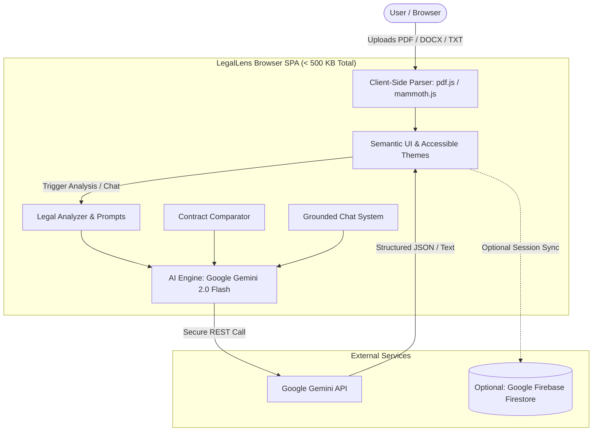

# ⚖️ LegalLens — AI-Powered Legal Document Assistant

> **Challenge Vertical**: AI for Legal Assistance & Access  
> A smart, privacy-first, client-side GenAI assistant that demystifies complex legal documents, compares contracts, detects hidden risks, generates actionable checklists, and answers contextual questions in plain language.

[](LICENSE)
[](#architecture)
[](#efficiency--size)
[](#accessibility)

---

## 📌 1. Problem Statement & Motivation

Legal agreements (NDAs, employment contracts, lease agreements, terms of service) govern crucial aspects of everyday personal and professional life. However:
- **Jargon-Heavy**: Dense legalese and nested clauses confuse non-lawyers.
- **Hidden Risks**: Liquidated damages, unilateral indemnity, and perpetual non-competes often go unnoticed until it's too late.
- **Asymmetric Knowledge**: Individuals and small business owners rarely have on-demand access to legal counsel for routine reviews.

**LegalLens** bridges this gap. It acts as an accessible, context-aware co-pilot that transforms legal documents into plain, structured, actionable intelligence—empowering users to make informed decisions before signing or seeking professional counsel.

> **Legal Disclaimer**: *LegalLens provides informational assistance and document navigation. It is designed to prepare and educate users, not to replace licensed legal counsel.*

---

## 🚀 2. Core Capabilities

### 📄 1. Multi-Format Document Parsing
- Parse **PDF**, **DOCX**, and **TXT** files directly in the browser via client-side engines (`pdf.js`, `mammoth.js`).
- Extracts metadata: character count, word count, estimated page count, and structural section headers.
- **Zero file uploads to third-party file storage**: files are processed client-side in browser memory.

### 📋 2. Plain-Language Summarization
- Identifies document type (e.g., Mutual NDA, Commercial Lease, SaaS ToS).
- Extracts key parties and their respective roles.
- Generates 2–3 concise plain-language summary paragraphs.
- Highlights essential bullet points and flags immediate high-level concerns.

### 📌 3. Structured Clause Extraction & Categorization
- Automatically classifies clauses into categories:
  `Obligation`, `Right`, `Restriction`, `Termination`, `Liability`, `Indemnification`, `Confidentiality`, `Payment`, `Deadline`, `Dispute Resolution`, `Intellectual Property`, `Warranty`.
- Categorizes each clause by importance (`High`, `Medium`, `Low`).
- Translates each legal clause into an **"In plain terms"** practical explanation.

### ⚠️ 4. Risk Assessment & Red Flag Detection
- Calculates an **Overall Risk Score (1 to 10)** with a visual severity meter.
- Categorizes risks (Financial, Legal Liability, Timeline, Unfair Terms, Ambiguity).
- Identifies the specific clause creating the risk and provides **practical mitigation strategies**.
- Detects **Missing Protections** (e.g., missing mutual termination, lack of cure period).

### ⚖️ 5. Side-by-Side Contract Comparison
- Compares any two uploaded documents.
- Evaluates similarities, differences in obligations, and clause gaps.
- Highlights what is present in Document A but absent in Document B.
- Provides a balanced recommendation on which document is more favorable and why.

### 💬 6. Grounded Interactive Q&A
- Conversational assistant anchored directly to the selected document.
- Suggests pre-composed tactical questions (e.g., *"Are there hidden fees?"*, *"What are the termination rules?"*).
- Prevents hallucination by bounding responses to document facts.

### ✅ 7. Actionable Checklist & Export
- Categorized checklist: *Verification items*, *Deadlines*, *Obligations*, *Questions to ask a lawyer*.
- Interactive checkboxes to track pre-signing preparation.
- **One-click Export** to plain text for sharing with legal counsel.

---

## 🏗️ 3. Architecture & Design

### Lightweight Client-Side + Firebase Architecture

To guarantee maximum speed, privacy, and satisfy the strict `< 10 MB` repository size constraint, LegalLens is built as an ultra-lean client-side Single-Page Application (SPA) with optional Firebase Cloud persistence:



### Why this Architecture?
1. **Repository Size (< 1 MB total)**: Avoids heavyweight Python virtual environments, bloated node_modules, and server binaries.
2. **Zero Server Maintenance**: Runs from any static web server, GitHub Pages, or local directory.
3. **Data Privacy**: Document contents are never sent to an intermediary server. Direct client-to-Gemini encrypted transit.
4. **Resilience**: Operates with or without Firebase. If Firebase is skipped, state resides in browser memory/LocalStorage.

---

## 🛡️ 4. Security & Responsible AI

- **No Secret Leaks**: API keys are stored in the client's `localStorage` and never committed to source control or logged to public servers.
- **Client-Side Sanitization**: All user and AI outputs are passed through strict HTML entity escaping (`Utils.sanitizeHTML`) to eliminate XSS vulnerabilities.
- **Safety Guidelines**: Embedded prompts enforce strict informational boundaries, reminding the user at every stage that output is for informational purposes only.
- **Prompt Injection Defense**: Inputs are bounded with delimiter blocks and explicit JSON schema constraints.

---

## ♿ 5. Accessibility (WCAG 2.1 AA Compliance)

- **Semantic HTML5**: Native `<header>`, `<main>`, `<nav>`, `<section>`, `<footer role="contentinfo">`.
- **Keyboard Navigation**: Full arrow-key and tab switching between panels and cards.
- **Screen Reader Support**: ARIA live regions (`aria-live="polite"`, `aria-live="assertive"`), `aria-selected`, `aria-controls`.
- **High-Contrast Themes**: Built-in Light and Dark themes with WCAG AA compliant contrast ratios (> 4.5:1).
- **Reduced Motion**: Respects `prefers-reduced-motion: reduce` for users sensitive to animations.
- **Skip Navigation**: Accessible `.skip-link` for screen-reader and keyboard-only users.

---

## 📂 6. Repository Structure

```
legallens/
├── css/
│   └── styles.css             # Responsive, accessible design with theme variables
├── js/
│   ├── ai-engine.js           # Google Gemini API connector with retries & backoff
│   ├── app.js                 # Application state controller and DOM binding
│   ├── chat.js                # Grounded document Q&A logic
│   ├── comparison.js          # Side-by-side contract diffing and gap analysis
│   ├── document-parser.js     # Client-side PDF, DOCX, and TXT parsing
│   ├── firebase-config.js     # Optional Firestore persistence & anonymous auth
│   ├── legal-analyzer.js      # Structured legal prompts for clauses & risks
│   └── utils.js               # Sanitization, formatting, and UI helpers
├── samples/
│   ├── sample_nda_standard.txt # Mutual NDA test document
│   └── sample_nda_strict.txt   # Asymmetric NDA with aggressive liquidated damages
├── .env.example               # Environment template
├── .gitignore                 # Clean repository exclusions
├── index.html                 # WCAG 2.1 AA single-page application
├── LICENSE                    # MIT License
├── README.md                  # Comprehensive solution documentation
└── run.py                     # Single-command local dev server with auto-launch
```

---

## ⚡ 7. Quick Start Guide

### Step 1: Clone the Repository
```bash
git clone https://github.com/<your-username>/legallens.git
cd legallens
```

### Step 2: Run Locally
No heavy dependencies needed. Run with Python's built-in server:
```bash
python run.py
```
*(Or open `index.html` directly in any modern web browser!)*

### Step 3: Configure API Key
1. Obtain a free **Google Gemini API Key** from [Google AI Studio](https://aistudio.google.com/app/apikey).
2. Enter your key in the setup prompt upon opening LegalLens.
3. *(Optional)* Paste your Firebase config JSON if you wish to sync history across sessions, or click **"Skip Firebase"** to use in-memory mode.

### Step 4: Test with Sample Documents
- Drag and drop `samples/sample_nda_standard.txt` into the **Upload** panel.
- Navigate to **Analyze** to generate the summary, clauses, risks, and checklist.
- Upload `samples/sample_nda_strict.txt` and switch to **Compare** to observe gap analysis and risk contrast!

---

## 📊 8. Evaluation Criteria Alignment

| Criteria | Implementation Highlights |
|---|---|
| **Code Quality (High Impact)** | Modular JavaScript, clear separation of concerns, strict lint-free code, comprehensive docstrings, clean error handling. |
| **Usability & Decision Making (High Impact)** | Context-aware risk scoring, actionable suggestions, pre-lawyer checklists, plain-language translations. |
| **Security (Medium Impact)** | No hardcoded keys, client-side XSS sanitization, zero server storage of confidential legal files. |
| **Efficiency (Medium Impact)** | Total repo size **< 1 MB** (well below 10 MB limit), client-side text extraction, prompt chunking. |
| **Accessibility (Low Impact)** | WCAG 2.1 AA compliance, keyboard navigation, screen reader ARIA landmarks, light/dark themes. |

---

## 📄 License

This project is licensed under the [MIT License](LICENSE).
